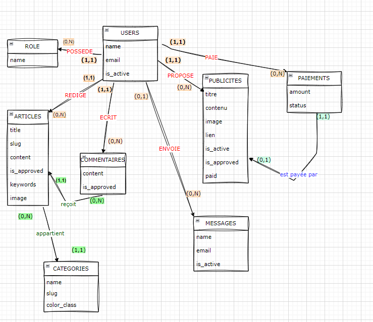
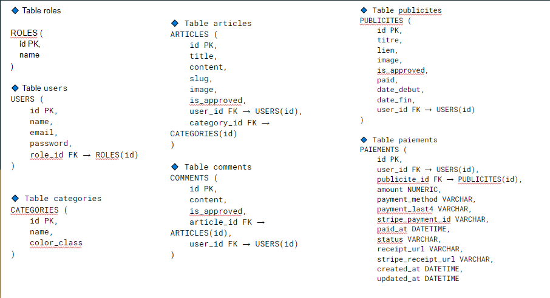
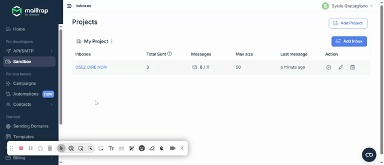
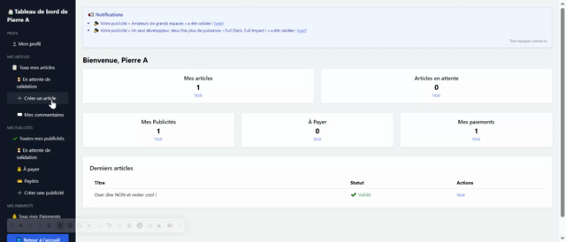

# Blog : Osez Dire Non  

## 🎯 Introduction

**"Osez Dire Non"** est un blog participatif, éducatif et engagé, conçu pour offrir un espace d’expression libre à celles et ceux qui souhaitent témoigner, sensibiliser ou conseiller sur des sujets souvent passés sous silence : pression sociale, abus de pouvoir, inégalités, discriminations, etc.

Le site inclut un **système de rôles** (éditeur/admin), un **espace publicitaire payant**, et une **modération des contenus**.  
Chaque contribution est modérée avec soin avant publication afin de garantir un cadre respectueux, constructif et bienveillant.

---

## 📁 Guide d’installation – Local (WAMP / SQLite)

1. **Installer [WAMP](https://www.wampserver.com/)**  
2. **Installer [Composer](https://getcomposer.org/)**  
3. **Créer projet Laravel avec Breeze et Vite**
```bash
composer create-project laravel/laravel osezdirenon
cd osezdirenon
composer require laravel/breeze --dev
php artisan breeze:install blade
npm install && npm run dev
```

4. **Configurer SQLite dans `.env`**
```
DB_CONNECTION=sqlite
DB_DATABASE=./database/database.sqlite
```

5. **Créer la base et lancer le site sous windows**
```bash
1/Créer manuellement le fichier database.sqlite dans dossier : C:\Users\Utilisateur\Desktop\blog\database\database.sqlite
ou 
C:\Users\Utilisateur\Desktop\blog> type nul > database\database.sqlite

php artisan migrate --seed
php artisan serve
```

---

### 🧱 Conception technique

# Modèle conceptuel (MCD): entités clés de mon blog  ainsi que leurs relations. Il permet de structurer les données avant la création physique de la base.

# Relations avec cardinalités (notation Merise)

## ➤ Relations partant de `USERS`

- Un **utilisateur** possède **un rôle** → 1:1 (`users → roles`)
- Un **utilisateur** rédige **plusieurs articles** → 1:N (`users → articles`)
- Un **utilisateur** écrit **plusieurs commentaires** → 1:N (`users → commentaires`)
- Un **utilisateur** propose **plusieurs publicités** → 1:N (`users → publicites`)
- Un **utilisateur** effectue **plusieurs paiements** → 1:N (`users → paiements`)
- Un **utilisateur** envoie **plusieurs messages** → 0:N (`users → messages`)

## ➤ Relations entre autres entités

- Un **article** appartient à **une catégorie** → N:1 (`articles → categories`)
- Un **article** reçoit **plusieurs commentaires** → 1:N (`articles → commentaires`)
- Une **publicité** est liée à **un paiement** → 0:1 (`publicites → paiements`)
- Un **paiement** concerne **une publicité** → 1:1 (`paiements → publicites`)




# logique (MLD): représentation plus technique avec types de données, clés primaires et étrangères.


 # physique (MPD):
- Diagramme UML des entités et des cas d’usage
- Base de données SQLite avec Seeders et Migrations Laravel

- Modèle Physique de Données (extrait SQL):

```sql
CREATE TABLE users (
    id INTEGER PRIMARY KEY AUTOINCREMENT,
    name TEXT NOT NULL,
    email TEXT UNIQUE NOT NULL,
    password TEXT NOT NULL,
    role_id INTEGER,
    FOREIGN KEY (role_id) REFERENCES roles(id)
);

CREATE TABLE roles (
    id INTEGER PRIMARY KEY AUTOINCREMENT,
    name TEXT NOT NULL
);

CREATE TABLE categories (
    id INTEGER PRIMARY KEY AUTOINCREMENT,
    name TEXT NOT NULL,
    slug TEXT NOT NULL
);

CREATE TABLE articles (
    id INTEGER PRIMARY KEY AUTOINCREMENT,
    title TEXT NOT NULL,
    slug TEXT NOT NULL,
    content TEXT,
    category_id INTEGER,
    user_id INTEGER,
    is_approved BOOLEAN DEFAULT false,
    keywords TEXT,
    image TEXT,
    deleted_at TIMESTAMP,
    FOREIGN KEY (category_id) REFERENCES categories(id),
    FOREIGN KEY (user_id) REFERENCES users(id)
);

CREATE TABLE comments (
    id INTEGER PRIMARY KEY AUTOINCREMENT,
    content TEXT NOT NULL,
    article_id INTEGER,
    user_id INTEGER,
    FOREIGN KEY (article_id) REFERENCES articles(id),
    FOREIGN KEY (user_id) REFERENCES users(id)
);

CREATE TABLE publicites (
    id INTEGER PRIMARY KEY AUTOINCREMENT,
    titre TEXT,
    lien TEXT,
    image TEXT,
    is_approved BOOLEAN DEFAULT false,
    paid BOOLEAN DEFAULT false,
    user_id INTEGER,
    FOREIGN KEY (user_id) REFERENCES users(id)
);

CREATE TABLE paiements (
    id INTEGER PRIMARY KEY AUTOINCREMENT,
    montant INTEGER,
    stripe_id TEXT,
    valid_until DATE,
    user_id INTEGER,
    publicite_id INTEGER,
    FOREIGN KEY (user_id) REFERENCES users(id),
    FOREIGN KEY (publicite_id) REFERENCES publicites(id)
);
```
# schéma UML de mon projet Laravel :

- `users` → `roles`  
  🔁 **Relation :** N:1  
   *Un utilisateur appartient à un rôle (admin ou éditeur). Un rôle peut avoir plusieurs utilisateurs.*

- `articles` → `users`  
  🔁 **Relation :** N:1  
   *Un article est rédigé par un utilisateur. Un utilisateur peut rédiger plusieurs articles.*

- `articles` → `categories`  
  🔁 **Relation :** N:1  
   *Un article appartient à une seule catégorie. Une catégorie peut regrouper plusieurs articles.*

- `comments` → `articles`  
  🔁 **Relation :** N:1  
   *Un commentaire est lié à un article.*

- `comments` → `users`  
  🔁 **Relation :** N:1  
   *Un commentaire est écrit par un utilisateur.*

- `publicites` → `users`  
  🔁 **Relation :** N:1  
   *Une publicité est proposée par un utilisateur.*

- `paiements` → `users`  
  🔁 **Relation :** N:1  
   *Un paiement est réalisé par un utilisateur.*

- `paiements` → `publicites`  
  🔁 **Relation :** 1:1  
   *Chaque paiement est lié à une publicité unique.*


---

### 🏗️ Architecture Laravel
clair :
  - **Models** : Article, Comment, User, Publicite, Paiement, Category, ContactMessage
  - **Controllers** : séparés par rôle (admin, éditeur, public, Stripe)
  - **Views** :
    - `resources/views/admin/...`
    - `resources/views/editeur/...`
    - `resources/views/auth/...`
    - `resources/views/contact.blade.php`, `home.blade.php`...

- Routes protégées :

- Middleware : auth, role:admin, role:editeur
- Fichier : routes/web.php
---

### 🔐 Authentification et redirection par rôle

Utilisation de **Laravel Breeze** pour tous les utilisateurs via le formulaire `/login`.

Redirection personnalisée selon le rôle dans `AuthenticatedSessionController` :
```php
public function redirectTo($user)
{
    if ($user->role->name === 'admin') {
        return route('admin.dashboard');
    } elseif ($user->role->name === 'editeur') {
        return route('editeur.dashboard');
    }
    return '/';
}
```

- L’éditeur peut s’inscrire via `/register` (Breeze)
- L’administrateur est créé en base, pas de formulaire d’inscription

---

## 🧩 Vues Blade et Breeze

- Organisation par rôle :
  - `admin/` : dashboard, validation, statistiques
  - `editeur/` : articles, pubs, commentaires, profil
- Breeze utilisé pour les vues `auth/` : login, register, mot de passe oublié
- Layouts séparés (`layout.blade.php`, `admin.layout.blade.php`, `editeur.layout.blade.php`)

---
### 🖼️ Présentation visuelle des pages (Figma)

Pour préparer l’interface utilisateur, j’ai réalisé deux maquettes sur Figma en version **desktop** et **mobile** :

# 🔹 Page statique HTML / CSS (sans données dynamiques)

Cette page est un prototype statique conçu pour tester la structure, les couleurs et la responsivité avec **Flexbox et Grid**.


# 🔸 Page dynamique d’accueil (avec données Laravel)

La page d’accueil affiche les **articles validés** et les **publicités actives**, grâce à un contrôleur `HomeController`.  
Elle utilise des composants Blade dynamiques avec pagination et Swiper.js pour le carrousel.


## 🎬 Démonstrations animées (GIF)

- Ces animations illustrent le bon fonctionnement du site sur desktop  :
---
### 🏠 Page d’accueil et connexion administrateur  


---
### 📢 Page contact et visuel sur Mailtrap  




---

### 📃 Page création d’article  


---


### 💡 Intégration Vite.js

Le projet utilise **Vite** comme bundler JavaScript et CSS via Laravel Breeze Blade.
- Compilation CSS/JS avec : `npm run dev`
- Hot Reload via `npm run dev`
- TailwindCSS inclus via Vite

---

### 🎯 RGPD & Bandeau cookies

Le site affiche un **bandeau RGPD** informatif en bas de page à la première visite.
- Fonctionne avec `localStorage`
- Disparaît au clic sur "Accepter"
- Aucune collecte de données personnelles

---

### 📦 Dépendances principales

- Laravel 12
- Laravel Breeze (Blade)
- Tailwind CSS
- Vite.js
- SQLite
- Stripe PHP SDK
- Swiper.js

---

### 📚 Tous les contrôleurs Laravel utilisés

| Contrôleur                     | Rôle principal                                                                 |
|-------------------------------|--------------------------------------------------------------------------------|
| `AdminController`             | Dashboard Admin, validation articles/publicités, statistiques                  |
| `EditeurController`           | Dashboard Éditeur, création articles/publicités, modération, commentaires      |
| `ArticleController`           | Création, modification, upload image, affichage public                         |
| `PubliciteController`         | Validation des pubs, accès publicités actives côté admin                       |
| `CommentController`           | Création, affichage, validation des commentaires                               |
| `ContactController`           | Traitement du formulaire de contact vers Mailtrap                             |
| `CategoryController`          | Filtrage des articles par catégorie                                            |
| `PaiementController`          | Affichage des paiements pour l’éditeur                                         |
| `StripeController`            | Redirection vers Stripe, gestion du paiement d’une pub                         |
| `StripeWebhookController`     | Réception des webhooks Stripe : mise à jour `paiement`                         |
| `ProfileController`           | Modification du profil éditeur avec Breeze                                     |
| `ProfilController` *(admin)*  | Accès au profil admin                                          |
| `HomeController`              | Page d’accueil (articles + publicités défilantes)                             |
| `AuthenticatedSessionController` | Connexion/déconnexion personnalisée avec redirection par rôle           |
| `RegisteredUserController`    | Inscription d’un éditeur via Laravel Breeze                                    |

---

### 🧩 Déploiement du projet via GitHub

## 🔧 Créer un dépôt GitHub

1. Aller sur [GitHub](https://github.com)
2. Créer un dépôt `osezdirenon`
3. Ne pas initialiser avec README

## 🔄 Relier à VS Code :
 C:\Users\Utilisateur\Desktop\blog>
```bash

git init
git remote add origin https://github.com/SylvieProjectLaplateForme/osezdirenon.git
git add .
git commit -m "Initial commit"
git push -u origin main
```

---

## 🧩 Clonage du projet Laravel "Osez Dire Non"

```bash
git clone https://github.com/SylvieProjectLaplateForme/osezdirenon.git
cd osezdirenon
composer install
cp .env.example .env
php artisan key:generate
touch database/database.sqlite
php artisan migrate --seed
npm install && npm run dev
php artisan serve
```

---

👉 Le site est prêt à l’emploi sur `http://127.0.0.1:8000`
