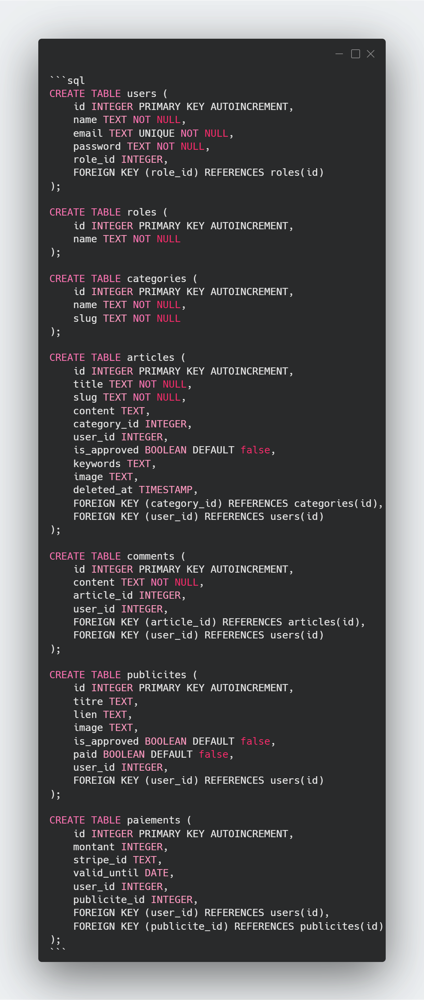
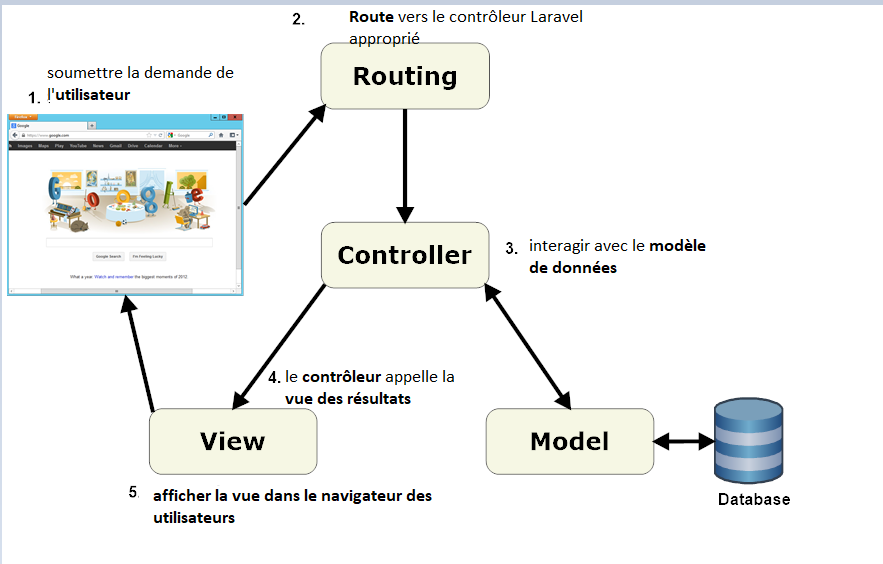
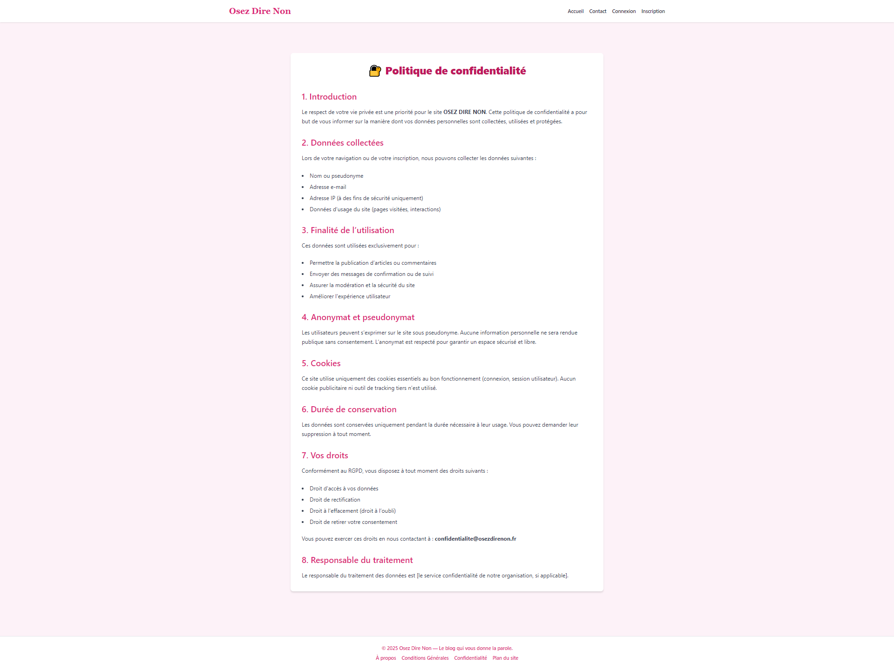
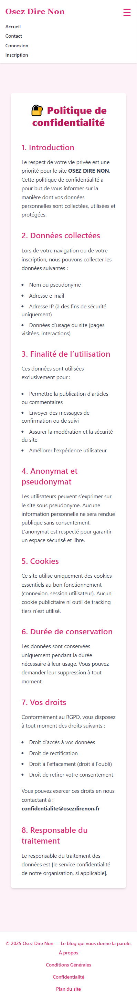

# Blog : Osez Dire Non  

## 🎯 Introduction

**"Osez Dire Non"** est un blog participatif, éducatif et engagé, conçu pour offrir un espace d’expression libre à celles et ceux qui souhaitent témoigner, sensibiliser ou conseiller sur des sujets souvent passés sous silence : pression sociale, abus de pouvoir, inégalités, discriminations, etc.

Le site inclut un **système de rôles** (éditeur/admin), un **espace publicitaire payant**, et une **modération des contenus**.  
Chaque contribution est modérée avec soin avant publication afin de garantir un cadre respectueux, constructif et bienveillant.

---

## 📁 Guide d’installation – Local (WAMP / SQLite)

1. **Installer [WAMP](https://www.wampserver.com/)**  
2. **Installer [Composer](https://getcomposer.org/)**  
3. **Créer projet Laravel avec Breeze et Vite**
```bash
composer create-project laravel/laravel osezdirenon
cd osezdirenon
composer require laravel/breeze --dev
php artisan breeze:install blade
npm install && npm run dev
```

4. **Configurer SQLite dans `.env`**
```bash
DB_CONNECTION=sqlite
DB_DATABASE=./database/database.sqlite
```

5. **Créer la base et lancer le site sous windows**
```bash
1/Créer manuellement le fichier database.sqlite dans dossier : C:\Users\Utilisateur\Desktop\blog\database\database.sqlite
ou 
C:\Users\Utilisateur\Desktop\blog> type nul > database\database.sqlite

php artisan migrate --seed
php artisan serve
```

---

### 🧱 Conception technique

## Modèle conceptuel (MCD): 

# Relations entre les entités avec cardinalités (notation Merise) 

Ce document présente les relations entre les différentes entités du projet, avec les verbes de relation, les cardinalités, et l’explication du sens N → 1.

## 🔄 Relations Eloquent et base de données

### 1. Article → User
- **Verbe** : est rédigé par
- **Cardinalité** : (0,N) → (1,1)
- **Explication** : Un article appartient à un seul utilisateur (FK dans `articles.user_id`). Un utilisateur peut rédiger plusieurs articles.

### 2. Article → Catégorie
- **Verbe** : appartient à
- **Cardinalité** : (0,N) → (1,1)
- **Explication** : Un article appartient à une seule catégorie. Une catégorie peut contenir plusieurs articles (FK : `articles.category_id`).

### 3. Commentaire → Article
- **Verbe** : concerne
- **Cardinalité** : (0,N) → (1,1)
- **Explication** : Un commentaire est lié à un seul article. Un article peut avoir plusieurs commentaires.

### 4. Commentaire → User
- **Verbe** : est rédigé par
- **Cardinalité** : (0,N) → (1,1)
- **Explication** : Un commentaire est rédigé par un seul utilisateur. Un utilisateur peut écrire plusieurs commentaires.

### 5. Publicité → User
- **Verbe** : est proposée par
- **Cardinalité** : (0,N) → (1,1)
- **Explication** : Une publicité est proposée par un utilisateur. Un utilisateur peut soumettre plusieurs publicités.

### 6. Paiement → Publicité
- **Verbe** : est lié à
- **Cardinalité** : (1,1) → (1,1)
- **Explication** : Chaque publicité peut être associée à un paiement. Relation 1:1 (clé étrangère dans `paiements.publicite_id`).

## ✅ Résumé : Relations & Foreign Keys

| Entité source | Relation          | Entité cible | Clé étrangère dans... |
|---------------|-------------------|---------------|-------------------------|
| Article       | est rédigé par     | User          | `articles.user_id`     |
| Article       | appartient à       | Catégorie     | `articles.category_id` |
| Commentaire   | est rédigé par     | User          | `commentaires.user_id` |
| Commentaire   | concerne           | Article       | `commentaires.article_id` |
| Publicité     | est proposée par   | User          | `publicites.user_id`   |
| Paiement      | est lié à          | Publicité     | `paiements.publicite_id` |

👉 **Astuce** : on part toujours du côté (N) vers (1), car le côté "N" porte la clé étrangère.

---

🛠️ Ce modèle sert à construire mes migrations, relations Eloquent (`belongsTo`, `hasMany`) et à bien structurer ma base de données.


# logique (MLD): représentation plus technique avec types de données, clés primaires et étrangères.


 # physique (MPD):

- Base de données SQLite avec Seeders et Migrations Laravel
- Modèle Physique de Données (extrait SQL):



---

### 🏗️ Architecture Laravel
---

---
clair :
  - **Models** : Article, Comment, User, Publicite, Paiement, Category, ContactMessage
  - **Controllers** : séparés par rôle (admin, éditeur, public, Stripe)
  - **Views** :
    - `resources/views/admin/...`
    - `resources/views/editeur/...`
    - `resources/views/auth/...`
    - `resources/views/contact.blade.php`, `home.blade.php`...

- Routes protégées :

- Middleware : auth, role:admin, role:editeur
- Fichier : routes/web.php
---

### 🔐 Authentification et redirection par rôle

Utilisation de **Laravel Breeze** pour tous les utilisateurs via le formulaire `/login`.

Redirection personnalisée selon le rôle dans `AuthenticatedSessionController` :
```php
public function redirectTo($user)
{
    if ($user->role->name === 'admin') {
        return route('admin.dashboard');
    } elseif ($user->role->name === 'editeur') {
        return route('editeur.dashboard');
    }
    return '/';
}
```

- L’éditeur peut s’inscrire via `/register` (Breeze)
- L’administrateur est créé en base, pas de formulaire d’inscription

---

## 🧩 Vues Blade et Breeze

- Organisation par rôle :
  - `admin/` : dashboard, validation, statistiques
  - `editeur/` : articles, pubs, commentaires, profil
- Breeze utilisé pour les vues `auth/` : login, register, mot de passe oublié
- Layouts séparés (`layout.blade.php`, `admin.layout.blade.php`, `editeur.layout.blade.php`)

---
### 🖼️ Présentation visuelle des pages (Figma)

Pour préparer l’interface utilisateur, j’ai réalisé deux maquettes sur Figma en version **desktop** et **mobile** :

# 🔹 Page statique HTML / CSS (sans données dynamiques)

Cette page est un prototype statique conçu pour tester la structure, les couleurs et la responsivité avec **Flexbox et Grid**.

### Version desktop


### Version Mobile



# 🔸 Page dynamique d’accueil (avec données Laravel)

La page d’accueil affiche les **articles validés** et les **publicités actives**, grâce à un contrôleur `HomeController`.  
Elle utilise des composants Blade dynamiques avec pagination et Swiper.js pour le carrousel.


## 🎬 Démonstrations animées (GIF)

- Ces animations illustrent le bon fonctionnement du site sur desktop  :
---
### 🏠 Page d’accueil et connexion administrateur  


---
### 📢 Page contact et visuel sur Mailtrap  


---

### 📃 Page création d’article  


---


### 💡 Intégration Vite.js

Le projet utilise **Vite** comme bundler JavaScript et CSS via Laravel Breeze Blade.
- Compilation CSS/JS avec : `npm run dev`
- Hot Reload via `npm run dev`
- TailwindCSS inclus via Vite

---

### 🎯 RGPD & Bandeau cookies

Le site affiche un **bandeau RGPD** informatif en bas de page à la première visite.
- Fonctionne avec `localStorage`
- Disparaît au clic sur "Accepter"
- Aucune collecte de données personnelles

---

### 📦 Dépendances principales

- Laravel 12
- Laravel Breeze (Blade)
- Tailwind CSS
- Vite.js
- SQLite
- Stripe PHP SDK
- Swiper.js

---

### 📚 Tous les contrôleurs Laravel utilisés

| Contrôleur                     | Rôle principal                                                                 |
|-------------------------------|--------------------------------------------------------------------------------|
| `AdminController`             | Dashboard Admin, validation articles/publicités, statistiques                  |
| `EditeurController`           | Dashboard Éditeur, création articles/publicités, modération, commentaires      |
| `ArticleController`           | Création, modification, upload image, affichage public                         |
| `PubliciteController`         | Validation des pubs, accès publicités actives côté admin                       |
| `CommentController`           | Création, affichage, validation des commentaires                               |
| `ContactController`           | Traitement du formulaire de contact vers Mailtrap                             |
| `CategoryController`          | Filtrage des articles par catégorie                                            |
| `PaiementController`          | Affichage des paiements pour l’éditeur                                         |
| `StripeController`            | Redirection vers Stripe, gestion du paiement d’une pub                         |
| `StripeWebhookController`     | Réception des webhooks Stripe : mise à jour `paiement`                         |
| `ProfileController`           | Modification du profil éditeur avec Breeze                                     |
| `ProfilController` *(admin)*  | Accès au profil admin                                          |
| `HomeController`              | Page d’accueil (articles + publicités défilantes)                             |
| `AuthenticatedSessionController` | Connexion/déconnexion personnalisée avec redirection par rôle           |
| `RegisteredUserController`    | Inscription d’un éditeur via Laravel Breeze                                    |

---

### 🧩 Déploiement du projet via GitHub

## 🔧 Créer un dépôt GitHub

1. Aller sur [GitHub](https://github.com)
2. Créer un dépôt `osezdirenon`
3. Ne pas initialiser avec README

## 🔄 Relier à VS Code :
 C:\Users\Utilisateur\Desktop\blog>
```bash

git init
git remote add origin https://github.com/SylvieProjectLaplateForme/osezdirenon.git
git add .
git commit -m "Initial commit"
git push -u origin main
```

---

## 🧩 Clonage du projet Laravel "Osez Dire Non"

```bash
git clone https://github.com/SylvieProjectLaplateForme/osezdirenon.git
cd osezdirenon
composer install
cp .env.example .env
php artisan key:generate
database/database.sqlite
php artisan migrate --seed
npm install && npm run dev
php artisan serve
```

---

👉 Le site est prêt à l’emploi sur `http://127.0.0.1:8000`
